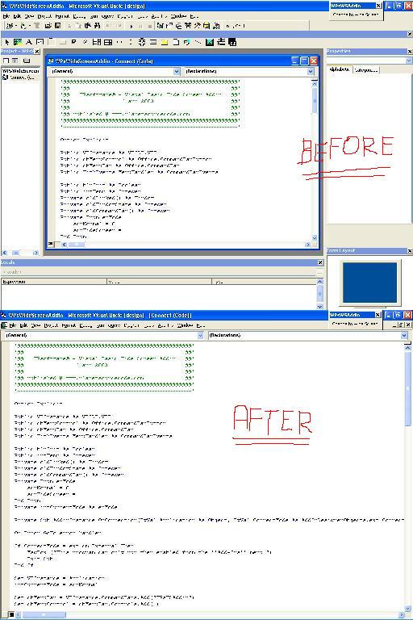



## Full screen code window \! \(by pressing ONE button\) UPDATED on 18 apr 2003 \!

### Description

With this code (Visual Basic Add-in actually) you can switch your code window to full screen! It becomes very usefull when our screen is filled with a lot of extra toolbars, commandbars ans properties-windows. By pressing ALT-C you switch to full screen, which means that all the extra toolbars and commandbars (exept the main toolbar) disappear. By pressing ALT-C again, all your toolbars are back in place.

All you have to do is open the project, compile the DLL, register it and restart VB. An extra commandbar will be added then with one button: 'Switch to wide screen'

Enjoy! - Any feedback appreciated UPDATE*UPDATE*UPDATE*UPDATE 18 apr 2003 UPDATE: The commandbar is no more floating but fixed and still available with ALT-C ! I also added comments .. and fixed a bug that came up when there were no windows or commandbars to hide!
 
### More Info
 

             |
---                |---
**Submitted On**   |2003-04-16 17:04:48
**By**             |[Willem Pardaens](https://github.com/Planet-Source-Code/PSCIndex/blob/master/ByAuthor/willem-pardaens.md)
**Level**          |Intermediate
**User Rating**    |4.7 (42 globes from 9 users)
**Compatibility**  |VB 5\.0, VB 6\.0
**Category**       |[VB function enhancement](https://github.com/Planet-Source-Code/PSCIndex/blob/master/ByCategory/vb-function-enhancement__1-25.md)
**World**          |[Visual Basic](https://github.com/Planet-Source-Code/PSCIndex/blob/master/ByWorld/visual-basic.md)
**Archive File**   |[Full\_scree1575664182003\.zip](https://github.com/Planet-Source-Code/willem-pardaens-full-screen-code-window-by-pressing-one-button-updated-on-18-apr-2003__1-44786/archive/master.zip)

